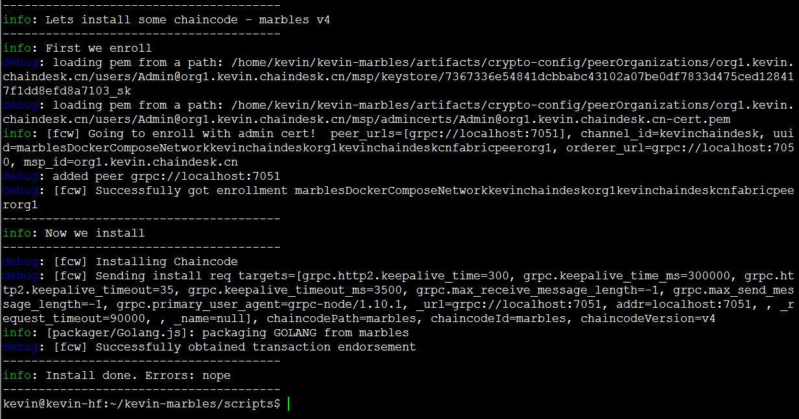
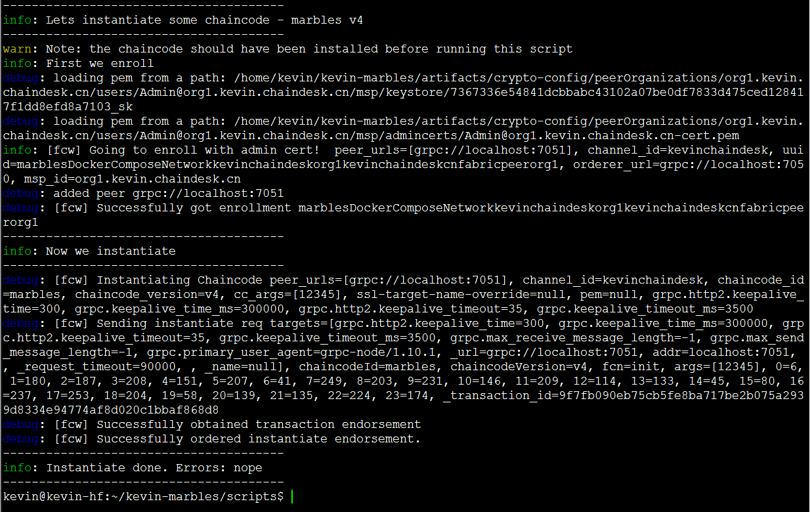
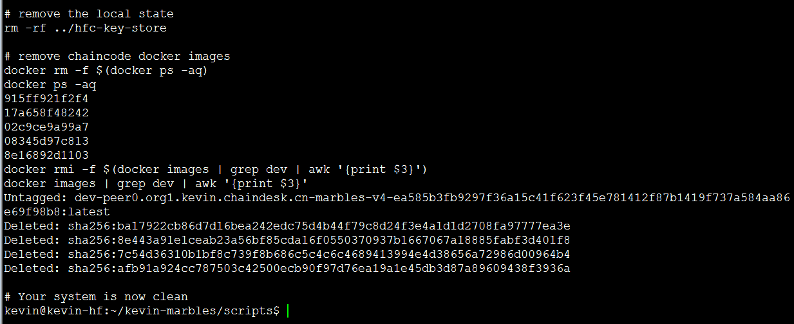

[TOC]

## 从零到壹实现Marbles资产管理系统 （Fabric-SDK-Node）之－测试

> 链码的安装、实例化功能编写完毕，我们可以对其进行测试，以验证代码及相应配置的正确性。为了方便起见，我们需要创建相应的脚本来启动Hyperledger Fabric网络环境，然后使用node命令来调用链码安装、实例化脚本来实现测试目的。

### 创建网络启动脚本

创建 start.sh 脚本并编辑， 该脚本文件主要作用如下：

- **设置环境变量**
- **根据指定的配置文件启动区块链网络**
- **创建通道**
- **将指定的peer节点加入到通道中**

```shell
$ cd ~/kevin-marbles/scripts
$ vim start.sh
```

start.sh 脚本完整内容如下：

```shell
#!/bin/bash
set -ev
export MSYS_NO_PATHCONV=1
export COMPOSE_PROJECT_NAME=net

docker-compose -f ../artifacts/docker-compose.yaml down

rm -rf ../hfc-key-store

docker-compose -f ../artifacts/docker-compose.yaml up -d ca.org1.kevin.chaindesk.cn orderer.kevin.chaindesk.cn peer0.org1.kevin.chaindesk.cn

# wait for Hyperledger Fabric to start
# incase of errors when running later commands, issue export FABRIC_START_TIMEOUT=<larger number>
export FABRIC_START_TIMEOUT=10
#echo ${FABRIC_START_TIMEOUT}
sleep ${FABRIC_START_TIMEOUT}

# Create the channel
docker exec -e "CORE_PEER_LOCALMSPID=org1.kevin.chaindesk.cn" -e "CORE_PEER_MSPCONFIGPATH=/etc/hyperledger/msp/users/Admin@org1.kevin.chaindesk.cn/msp" peer0.org1.kevin.chaindesk.cn peer channel create -o orderer.kevin.chaindesk.cn:7050 -c kevinchaindesk -f /etc/hyperledger/configtx/channel.tx
# Join peer0.org1.kevin.chaindesk.cn to the channel.
docker exec -e "CORE_PEER_LOCALMSPID=org1.kevin.chaindesk.cn" -e "CORE_PEER_MSPCONFIGPATH=/etc/hyperledger/msp/users/Admin@org1.kevin.chaindesk.cn/msp" peer0.org1.kevin.chaindesk.cn peer channel join -b kevinchaindesk.block
```

为 start.sh 脚本添加可执行权限

```shell
$ chmod 777 ./start.sh
```

start.sh 脚本具有了可执行权限之后，我们就可以执行 start.sh 脚本，用来启动我们的区块链网络。

### 启动网络

```shell
$ cd ~/kevin-marbles/scripts
$ ./start.sh
```

输出如下类似信息：


完成后，我们需要将链代码放到peer的文件系统上。记住，chaincode定义了弹珠（资产）是什么，并且实现了我们的弹珠交易的业务逻辑。可在此目录中找到弹珠链码`<marbles root>/chaincode/src/`。目录中包含了定义的弹珠结构体及链码相应的所有业务处理逻辑。

我们将使用的脚本`install_chaincode.js`位于`<marbles root>/scripts`文件夹中。它将读入我们的弹珠配置文件和连接配置文件数据。您可以通过编辑`install_chaincode.js`文件来更改弹珠链码ID或版本。

### 安装链码

使用以下命令安装弹珠链码文件

```shell
$ cd ~/kevin-marbles/scripts
$ node install_chaincode.js
```

命令执行成功输出如下类似信息：



### 实例化链码

使用如下命令实例化链码

```shell
$ node instantiate_chaincode.js
```

命令执行成功输出如下类似信息：



### 关闭并清理网络

```shell
$ cd ~/kevin-marbles/scripts
$ vim stop.sh
```

stop.sh 脚本完整内容如下

```sh
#!/bin/bash

set -ev

# Shut down the Docker containers that might be currently running.
# docker-compose -f ../artifacts/docker-compose.yaml stop

set -e

# Shut down the Docker containers for the system tests.
docker-compose -f ../artifacts/docker-compose.yaml kill && docker-compose -f ../artifacts/docker-compose.yaml down

# remove the local state
rm -rf ../hfc-key-store

# remove chaincode docker images
docker rm -f $(docker ps -aq)
docker rmi -f $(docker images | grep dev | awk '{print $3}')

# Your system is now clean
```

为 stop.sh 脚本添加可执行权限

```shell
$ chmod 777 ./stop.sh
```

执行

```shell
$ ./stop.sh
```

输出如下类似信息：




下一步：[sdk-node之实现事务与查询](https://github.com/kevin-hf/kevin-marbles/blob/master/md/9.%20sdk-node%E4%B9%8B%E5%AE%9E%E7%8E%B0%E4%BA%8B%E5%8A%A1%E4%B8%8E%E6%9F%A5%E8%AF%A2.md)